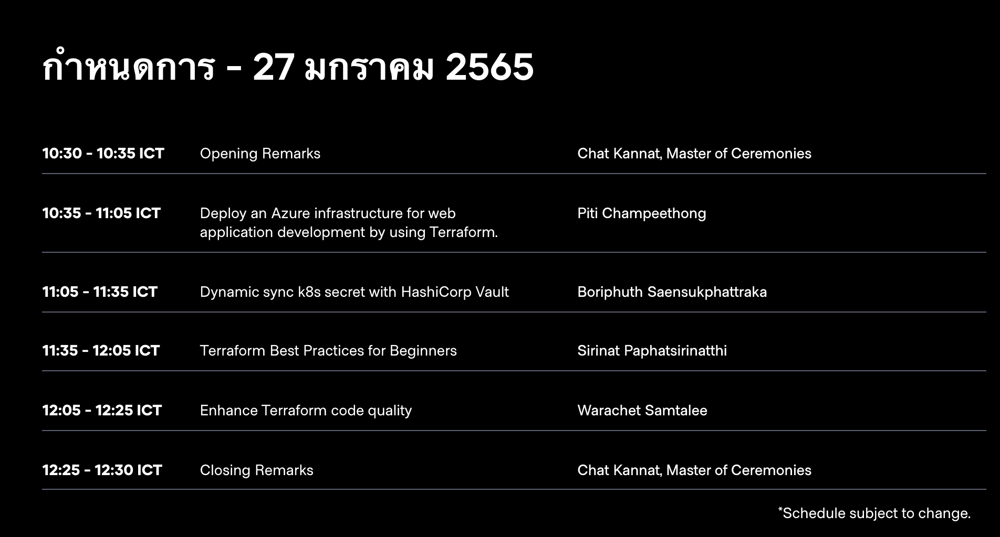
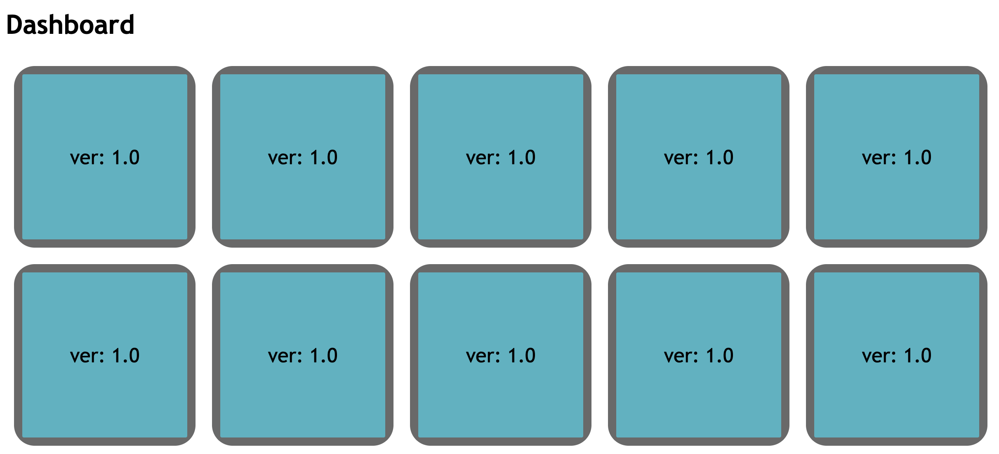

# devops-podinfo
This demo from https://events.hashicorp.com/hashitalksthailand

Topic Dynamic sync k8s secret with HashiCorp Vault





## Prerequisite

```
Vault server installed (On this demo use vault enterprise)
Vault side car installed

```

```
## Export environment

export VAULT_ADDR=https://vault.url/
export VAULT_TOKEN=xxxx
export VAULT_NAMESPACE="Analytics/devops"
export NAME_SPACE=podinfo
export SERVICE_ACCOUNT=vault-sidecar
export GCP_PROJECT=tdg-analytics-poc
export CLUSTER_NAME=devops-dev-cluster
export ROLE=vault-sidecar
export SERVICE_NAME=podinfo
export POLICY=$GCP_PROJECT/$CLUSTER_NAME/$SERVICE_NAME

./kubernetes-vault.sh

## Helm install podinfo

helm upgrade podinfo -f helm/podinfo/values.yaml helm/podinfo --debug  

## helm install podinfo-on without iwatch

helm upgrade  podinfo-no -f helm/podinfo/values-no-iwatch.yaml  helm/podinfo --debug  

```
## Issue
https://github.com/hashicorp/vault-k8s/issues/196
